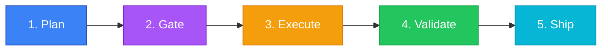

<p align="center">
  
</p>

<p align="center">
  <strong>OpenCloud Control Plane (OCCP)</strong><br>
  <em>Agent Control Plane with Verified Autonomy Pipeline</em>
</p>

<p align="center">
  <a href="https://github.com/azar-management-consulting/occp-core/actions"></a>
  
  
  
  
  
</p>

---

## 30-Second Quick Start

```bash
git clone https://github.com/azar-management-consulting/occp-core.git
cd occp-core
pip install -e ".[dev]"
occp demo
```

**That's it.** You'll see the full Verified Autonomy Pipeline in action — planning, gating, executing, validating, and shipping a task in real time.

Try prompt injection blocking:

```bash
occp demo --inject
```

---

## What is OCCP?

OCCP is an open-source **Agent Control Plane** that ensures AI agents operate safely, auditably, and within policy. Every agent task flows through the **Verified Autonomy Pipeline (VAP)**:



| Stage | What Happens |
|-------|-------------|
| **Plan** | Generate execution plan from task description |
| **Gate** | Policy engine checks — PII detection, prompt injection, resource limits |
| **Execute** | Sandboxed agent execution |
| **Validate** | Verify outputs match plan and pass quality checks |
| **Ship** | Deliver results with full audit trail |

---

## Installation

### CLI + API Server

```bash
pip install -e ".[dev]"
occp start          # Launch API on :8000
```

### Docker Compose (Full Stack)

```bash
docker compose up -d
# API: http://localhost:8000
# Dashboard: http://localhost:3000
```

### Development Mode

```bash
docker compose --profile dev up
# Uses hot-reload for both API and dashboard
```

---

## Architecture

| Module | Description |
|--------|-------------|
| `orchestrator/` | VAP pipeline engine — Protocol-based DI, state machine, transitions |
| `policy_engine/` | Policy-as-code, SHA-256 audit chain, PII/injection/resource guards |
| `api/` | FastAPI REST API + WebSocket real-time pipeline events |
| `adapters/` | Demo adapters — EchoPlanner, PolicyGate, MockExecutor, BasicValidator, LogShipper |
| `dash/` | Next.js 14 dashboard — dark theme, live pipeline visualization |
| `cli/` | Click CLI — `occp start`, `occp demo`, `occp run`, `occp status` |
| `sdk/` | Python + TypeScript SDKs |
| `config/` | YAML config templates (sandbox, channels, skills) |
| `scripts/` | Install, onboarding wizard, security report |
| `store/` | SQLAlchemy 2.0 ORM — TaskStore, AuditStore, AgentStore, UserStore |
| `tests/` | 328+ tests, 85%+ coverage |

## API Endpoints

| Method | Path | Description |
|--------|------|-------------|
| `GET` | `/api/v1/status` | Health check + version |
| `POST` | `/api/v1/auth/login` | JWT login |
| `POST` | `/api/v1/auth/refresh` | Token refresh |
| `POST` | `/api/v1/auth/register` | Create user (admin-only) |
| `POST` | `/api/v1/tasks` | Create a new task |
| `GET` | `/api/v1/tasks` | List all tasks |
| `GET` | `/api/v1/tasks/{id}` | Get task details |
| `POST` | `/api/v1/pipeline/run/{id}` | Run VAP pipeline on task |
| `POST` | `/api/v1/policy/evaluate` | Test content against policy guards |
| `GET` | `/api/v1/agents` | List registered agents |
| `POST` | `/api/v1/agents` | Register agent (admin/operator) |
| `DELETE`| `/api/v1/agents/{type}` | Unregister agent (admin) |
| `GET` | `/api/v1/audit` | Audit log with hash chain |
| `WS` | `/api/v1/ws/pipeline/{id}` | Real-time pipeline events |

## Policy Engine

- **PII Detection** — email, phone, SSN, credit card patterns
- **Prompt Injection Detection** — common attack patterns
- **Resource Limits** — configurable constraints
- **YAML/JSON Policies** — ALLOW / DENY / REQUIRE_APPROVAL actions
- **Tamper-Evident Audit** — SHA-256 hash chain, verifiable integrity

---

## CLI Commands

```
occp start              # Launch API server (uvicorn)
occp demo               # Run full VAP demo pipeline
occp demo --inject      # Demo prompt injection blocking
occp status             # Check API health
occp run TASK_ID        # Run pipeline on existing task
occp export --format json  # Export audit log
```

---

## RBAC (Role-Based Access Control)

| Role | Permissions |
|------|------------|
| `system_admin` | Full access — user management, agent CRUD, pipeline, audit |
| `org_admin` | Agent management, pipeline execution, audit read |
| `operator` | Task & pipeline execution, agent read |
| `viewer` | Read-only access to tasks, agents, audit |

Enforced via Casbin on every protected endpoint. WebSocket connections require `?token=` query param.

## Sandbox Executor

Code execution uses isolated sandboxing with automatic fallback:

1. **nsjail** — Linux namespace jail (preferred, requires `SYS_ADMIN`)
2. **bwrap** — Bubblewrap (user-namespace, no caps needed)
3. **process** — subprocess with resource limits (fallback)

Auto-detected at startup based on available binaries and kernel capabilities.

---

## Security

- Default-deny policy with allowlist overrides
- Channels bind `127.0.0.1` by default
- Secret scanning on every push (TruffleHog)
- No secrets in source control
- See [Secrets Policy](security/SECRETS_POLICY.md)

## Documentation

- [QuickStart](docs/QuickStart.md)
- [Architecture](docs/ARCHITECTURE.md)
- [API Reference](docs/API.md)
- [Competitor Comparison](docs/COMPARISON.md)
- [Secret Management](docs/SECRETS.md)

## Contributing

See [CONTRIBUTING.md](.github/CONTRIBUTING.md). Critical modules protected by [CODEOWNERS](.github/CODEOWNERS).

## License

Community Edition — **MIT**. See [LICENSE](LICENSE).

---

*Built by [Azar Management Consulting](https://azar.hu)*
