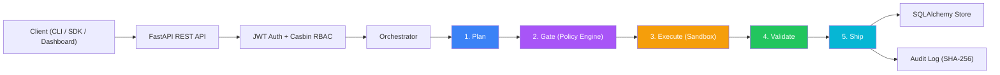

# Architecture

OCCP is a modular Agent Control Plane built on FastAPI, SQLAlchemy 2.0, and Casbin RBAC. Every autonomous agent action flows through the Verified Autonomy Pipeline (VAP) — a 5-stage protocol that ensures safety, auditability, and policy compliance before any output is delivered.

## System Overview



## Modules

| Module | Path | Responsibility |
|--------|------|---------------|
| **Orchestrator** | `orchestrator/` | VAP pipeline engine — protocol-based dependency injection, state machine, stage transitions |
| **Policy Engine** | `policy_engine/` | Policy-as-code evaluation, PII/injection/resource guards, SHA-256 audit chain |
| **API** | `api/` | FastAPI REST endpoints + WebSocket real-time events, request validation |
| **Store** | `store/` | SQLAlchemy 2.0 async ORM — TaskStore, AuditStore, AgentStore, UserStore |
| **Adapters** | `adapters/` | Pluggable stage implementations — EchoPlanner, PolicyGate, MockExecutor, BasicValidator, LogShipper |
| **Config** | `config/` | YAML configuration templates — sandbox, channels, skills, RBAC policy |
| **CLI** | `cli/` | Click-based CLI — `occp start`, `occp demo`, `occp run`, `occp status`, `occp export` |
| **SDK** | `sdk/` | Python + TypeScript client SDKs for API consumption |
| **Dashboard** | `dash/` | Next.js 15 dashboard — dark theme, live pipeline visualization |

## Data Flow: Verified Autonomy Pipeline (VAP)

```
Task Created → Plan Stage → Gate Stage → Execute Stage → Validate Stage → Ship Stage → Done
     │              │            │             │               │              │
     │              │            │             │               │              └─ Audit entry + hash chain
     │              │            │             │               └─ Output quality checks
     │              │            │             └─ Sandboxed execution (nsjail/bwrap/process)
     │              │            └─ PII guard, injection guard, resource limits, policy rules
     │              └─ Generate execution plan from task description
     └─ TaskStore persists to SQLite/PostgreSQL
```

Each stage is a protocol-defined adapter. The orchestrator resolves adapters via dependency injection, allowing any stage to be swapped without changing the pipeline logic.

## Database Schema

SQLAlchemy 2.0 ORM models with cross-dialect support (SQLite ↔ PostgreSQL):

| Table | Model | Key Columns |
|-------|-------|-------------|
| `tasks` | `TaskRow` | id, name, description, agent_type, risk_level, status, plan, result, error, metadata, created_at, updated_at |
| `audit_entries` | `AuditEntryRow` | id, event_type, actor, resource_type, resource_id, detail, hash, prev_hash, timestamp |
| `agent_configs` | `AgentConfigRow` | id, agent_type, config, is_active, registered_at, updated_at |
| `users` | `UserRow` | id, username, password_hash, role, is_active, created_at |

Indexes: `idx_tasks_status`, `idx_tasks_created`, `idx_audit_event_type`, `idx_audit_timestamp`, `idx_agents_type` (unique), `idx_users_username` (unique).

## Sandbox Execution

Code execution uses isolated sandboxing with automatic fallback detection at startup:

```
Startup Detection:
  1. Check nsjail binary + SYS_ADMIN capability → nsjail (Linux namespace jail)
  2. Check bwrap binary + user namespace support → bubblewrap (unprivileged)
  3. Fallback → subprocess with resource limits (ulimit)
```

| Backend | Isolation Level | Requirements |
|---------|----------------|--------------|
| **nsjail** | Full namespace (PID, NET, MNT, USER) | Linux, `nsjail` binary, `SYS_ADMIN` cap |
| **bwrap** | User namespace sandbox | Linux, `bubblewrap` binary |
| **process** | Resource-limited subprocess | Any OS (fallback) |

All sandbox backends enforce: time limits, memory limits, filesystem isolation, network restriction.

## Authentication Flow

```
Client POST /auth/login
  → Verify credentials against UserStore
  → Issue JWT access + refresh tokens
  → Client includes Bearer token in subsequent requests

Protected Request:
  → Extract JWT from Authorization header
  → Validate token signature + expiry
  → Extract user role from token claims
  → PermissionChecker middleware → Casbin policy evaluation
  → Allow or deny (403) based on config/rbac_policy.csv
```

### RBAC Role Hierarchy

```
system_admin
  └─ org_admin
       └─ operator
            └─ viewer
```

Each child role inherits all permissions of its parent. Permissions are defined as `(role, resource, action)` triples in `config/rbac_policy.csv` and enforced by the Casbin adapter on every protected endpoint.

WebSocket connections authenticate via `?token=JWT` query parameter and require at minimum `viewer` role with `tasks:read` permission.
